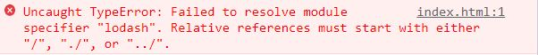

# viteFjq

## 1. 课程前言

Webpack ---> 市场份额大 生态成熟 学习资料完善

Vite --->

- 前卫、先进，解决了一些 webpack 解决不了的问题
- 未来会占有一席之地
- Vue 官方出品，生态完善，Vue-cli 会在之后的两个版本中将 vite 作为预设构建工具。这意味着未来使用 vue-cli 构建项目时写的 vue.config.js 不再是 webpack 的配置而是 vite 的配置（目前只基于浏览器项目）
- vite 支持构建 react、angular、svelte 项目

为什么要学 vite ---> 应对面试、搭建 vite 项目

## 2. 什么是构建工具

企业级项目里可能具备哪些功能：

> 浏览器只认识 html、css 和 js 语法，不认识 ts、react/vue、less/sass 等语法

- typescript：如果遇到 ts 文件我们需要使用 tsc 将 typescript 代码转换为 ts 代码
- react/vue：需要安装 react-compiler/vue-complier，将我们写的 jsx 文件或者.vue 文件转换为 render 函数
- less/sass/postcss/component-style：需要安装 less-loader，sass-loader 等一系列编译工具
- 语法降级（兼容老旧浏览器）：安装 babel，将 es 的新语法转换为旧版浏览器可以接收的语法
- 体积优化（网络传输时代码体积越小，效率越高）：安装 uglifyjs，将代码压缩，变成体积更小性能更高的文件

因为浏览器认识的语法有限，而我们实际的项目中要使用到很多封装的工具来开发，在开发结束之后要将这些封装的语法还原成浏览器可以识别的语法。但是因为工具库太多，项目文件太多，编译过程复杂，手动编译效率太低，因此如果有一个东西能够将这些功能集成在一起，我们只需要关心我们写的代码即可，只要代码有变化，就自动执行编译过程，构建工具就是用来实现这个功能的。

构建工具的工作不限于此，还有以下功能：

- 模块化开发支持：支持直接从 node_modules 里引入代码 + 多种模块化支持

  > 浏览器不认识 node_modules，不能从 node_modules 里引入功能（比如 lodash），只能通过相对路径或绝对路径引入
  >
  > 浏览器也不支持 ES6 模块化语法

- 处理代码兼容性：比如 babel 语法降级，less，ts 语法转换（**不是构建工具做的，是构建工具集成了这些语法对应的处理工具按照你的配置进行了自动化的处理**）

- 提高项目性能（通过文件打包）：压缩文件、代码分隔（webpack 的概念）

  > 打包：将我们写的浏览器不认识的代码，交给构建工具进行编译处理的过程。打包完成以后会形成一个浏览器可以认识的文件

- 优化开发体验：

  - 自动监听文件的变化，当文件变化以后自动调用对应的继承工具进行重新打包，然后在浏览器重新运行（整个过程叫做热更新，hot replacement）
  - 开发服务器：解决跨越的问题。用 react-cli create-react-element vue-cli 解决跨域问题（后续课程可以理解解决跨域问题的原理）

小结 --->

- 构建工具让我们不用关心代码如何在浏览器里运行，我们只需要给构建工具提供一个配置文件（这个配置文件也不是必须的，如果不传递，会有默认的配置帮你处理），有了这个集成文件，我们就可以在下次需要更新的时候调用一次对应的命令就好了，如果我们再结合热更新，我们就更加不需要管任何东西了。这就是构建工具做的事情，**它让我们不用关心生产环境的代码，也不用关心代码如何在浏览器里运行，只需要关心我们开发环境下的代码怎么写就行了。**（面试答这句话就行了）

**构建工具主要是做集成的工作**

市面上主流的构建工具：

- webpack
- vite
- esbuild

其他的构建工具：

- parcel
- rollup
- grunt
- gulp

## 3. Vite 相较于 webpack 的优势

[vite 官方文档](https://vitejs.cn/guide/why.html#the-problems)

vite 解决了 webpack 解决不了的一些问题：

> 然而，当我们开始构建越来越大型的应用时，需要处理的 JavaScript 代码量也呈指数级增长。包含数千个模块的大型项目相当普遍。我们开始遇到性能瓶颈 —— 使用 JavaScript 开发的工具通常需要很长时间（甚至是几分钟！）才能启动开发服务器，即使使用 HMR（热更新），文件修改后的效果也需要几秒钟才能在浏览器中反映出来。如此循环往复，迟钝的反馈会极大地影响开发者的开发效率和幸福感。

起因：我们的项目越大，构建工具（webpack）所要处理的 js 代码就越多【跟 webpack 的构建过程（工作流程）有关系】

造成的结果：构建工具需要很长时间才能启动开发服务器（启动开发服务器就是把项目跑起来，就是`npm run dev`、`npm run start`、`yarn start`、`yarn dev`等等）

这种痛上过班才知道

webpack 能不能改？改不了。如果一旦要改，会动到 webpack 的大动脉。

webpack 支持多种模块化（commonjs、es6 模块化）：你的工程可能不只是跑在浏览器端，也可能跑在服务器端

```js
// index.js
// webpack是可以同时写多种模块化语法的
// 这一段代码最终会到浏览器里去运行
const lodash = require("lodash");// commomjs规范
import Vue feom "vue"; // es6模块化
```

webpack 的转换结果：

```js
const lodash = webpack_require("lodash");
const vue = webpack_require("vue");
```

webpack 的编译原理（了解即可，不看也没关系）：AST 抽象语法分析的工具分析你写的 js 文件有哪些导入和导出操作。前端是没法改文件的，而构建工具是运行在服务端的，你输入命令，构建工具会启动后台服务器，会读你的文件把你的文件内容改了，替换成了 webpack 的语法，变成了一种统一的语法。最终 webpack 会将这个文件编译成一个立即执行函数，这样浏览器就可以识别了：

```js
(function () {
  function webpack_require(modules) {}
  // 入口是index.js
  // 通过webpack的配置文件得来的:webpack.config.js ./src/index.js
  modules[entry](webpack_require);
},
  {
    "index.js": () => {
      const lodash = webpack_require("lodash");
      const vue = webpack_require("vue");
    },
  });
```

因为 webpack 支持多种模块化，它一开始必须要统一模块化语法，则意味着它需要将所有的依赖文件全部读一遍（来检测每一个文件中有哪些地方用到了哪种模块化语法），所以有了需要很长时间才能启动服务器的问题。

Vite 是基于 es6 模块化的，它不会读所有的依赖文件，所以它启动速度非常快，所以它不会把 webpack 干趴下，它们只是侧重点不一样，webpack 侧重于兼容性，而 Vite 侧重于浏览器端的开发体验。


webpack 会把所有的依赖打包然后启动开发服务器，vite 是直接开启开发服务器，然后加载入口文件再按需加载依赖。项目越大，webpack 需要打包的依赖就越多，启动服务器需要的时间就越久。而 Vite 不管你的项目有多大，都是直接启动开发服务器，然后根据入口文件按需加载（后面的编译原理会详细了解这一过程）。所以，Vite 相对于 Webpack 的最大的优势就是快。
## 4. Vite 脚手架和 Vite 的区别

`yarn create vite`和`npm create vite`到底是什么意思？--->

1. 帮我们全局安装一个东西：create-vite（vite 的脚手架）

   > 脚手架就是一套预设
   >
   > 我们接触过 vue-cli

2. 直接运行 create-vite bin 目录下的执行配置

很多同学可能存在误区：**认为官网中使用对应 yarn create 构建项目的过程也是 vite 在做的事情**（但其实不是，这是 vite 脚手架 create-vite 在做的事情）

create-vite 和 vite 的关系是什么？ create-vite 内置了 vite，vite 是和 webpack 一样的构建工具，用来打包和构建代码的，对比 vue-cli 来看：使用 vue-cli 会内置 webpack，vue 项目是 vue-cli 构建的而不是 webpack 构建的，vue-cli 和 webpack 的关系就等同于 create-vite 和 vite 的关系。

我们先学习的是 vite，暂时不会使用`yarn create vite my-vue-app --template vue`。

拓展：vue-cli 为什么可以和 webpack 分的很清楚？

**预设**：我们做项目，很多功能需要自己去配置，一个一个的做很麻烦，我们可以直接使用构建工具来完成，这个构建工具就是一套具备项目中可能用到的各种功能的预设，它帮你把这些东西全配置好了，并且做好了最佳实践的配置，这样我们就不用和 webpack/vite 直接打交道，直接用脚手架工具配置即可。

vite 是 vue 团队的，create-vite 也是 vue 团队的。vite 团队为了弱化 vite 的存在感提和上手的使用难度，做了 create-vite 这个脚手架来让你直接使用 vite 的功能。

我们学习的时候是不能弱化 vite 的。
## 5. vite 启动项目初体验

Vite 和 webpack 一样是开箱即用的（out of box）：不需要做任何额外的配置就可以使用 vite 来帮你处理构建工作

新建 test-vite 目录，创建 index.html、main.js、counter.js，初始化一个包，安装 lodash，测试模块化语法，会报错：  



默认情况下，我们的 ES 模块化去导入资源的时候，要么是绝对路径，要么是相对路径，原因是浏览器不认识 node_modules 文件夹，不知道 lodash 这个路径，没有办法去找这个文件。

既然我们现在的最佳实践就是 node_modules，那为什么 es 官方在我们导入非绝对路径和非相对路径的资源的时候不默认帮我们去搜寻 node_modules 呢？

假设浏览器做了这件事，lodash 这个路径就会被发现，而 lodash 本身有其他依赖，而依赖之间又有更多的依赖，这样网络请求资源的数量会陡增，非常消耗性能，所以浏览器不敢这么去做。而 commonjs 是可以这样去做的，因为 commonjs 是运行于服务器端的，服务器端找文件不是通过网络请求去找的，而是直接读本地的文件，更多细节在 node 原理里，不展开讲。

现在 lodash 已经没办法加载了，我们直接安装 vite。

vite 是用来做代码构建的，直接安装在开发环境即可：`npm i vite -D`

在`package.json`里面添加脚本命令：

```json
"scripts":{
  "dev":"vite"
}
```

运行`npm run dev`启动项目。

此时可以看到模块可以被正常加载了，这就是 vite 的开箱即用（帮我们处理了浏览器端 es 模块化语法无法加载 lodash 的问题），完成了一个基本的构建工作，帮我们做了很多事情。

## 6. Vite 的依赖项构建

### vite 的预加载

```js
// 打包前的代码
import _ from "lodash";
```

vite 怎么处理的？在处理的过程中如果说看到了有非绝对路径或者相对路径的引用，vite 会尝试开启路径补全，变成下面这个样子：

```js
// 打包后的代码
import _ from "/node_modules/.vite/deps/lodash.js";
```

这样浏览器就能够找到对应的模块了。

**找寻依赖的过程是自当前目录依次向上查找的过程，直到搜寻到根目录或搜寻到对应依赖项为止。**

为什么需要使用预构建：

具体过程是首先看当前目录下有没有 lodash，然后看当前目录的父级目录有没有，一直找到最顶层的根目录或者找到依赖项为止，假设 lodash 在根目录 user 下，会打包生成这样一个目录/user/node_modules/lodash，因为补全的绝对路径是错的（vite 的根目录下可能没有 user），此时浏览器还是找不到的，那是不是会变成相对路径呢？相对路径可以，但是比较麻烦：

首先区分生产和开发两种环境：
npm run dev 每次都是只在开发环境运行，每次都会重新进行依赖预构建，每次依赖预构建所重新构建的相对路径都是正确的，而且每次文件发生变动时都会重新构建，所以它能找到。

这些（预构建）都是在开发环境下会做的事，生产环境下不会这么去做，生产环境下 vite 会全权交给一个叫做 rollup 的库去完成打包，此时就和 webpack 一样，在服务器端运行，且兼容特别多的规范和依赖。

这是开发路径和生产环境依赖预构建的过程（可以参考 webpack）。其中，相对路径可以，但是 vite 没有这样去做，Vite 主要考虑到了一些其他的问题。一个就是缓存（后面会讲）。

实际上，Vite 在考虑另外一个问题的时候就顺便把这个问题解决了。我们用了很多第三方库，有的库用的是 commonjs 规范导出，这个规范 Vite 就不认识了（Vite 只认识 ESM），此时，Vite 想了一个依赖预构建的方法。

### 依赖预构建

vite 会找到对应的依赖，然后调用 esbuild（用 go 语言写的对 js 语法进行处理的一个库），将其他规范的代码转换成 ESM 规范，然后放到当前目录下的 node_modules/.vite/deps 目录下，同时对 ESM 规范的各个模块进行统一集成，这个过程就是依赖预构建。

它解决了三个问题：

1. 不同的第三方包会有不同的导出格式（这是 vite 管不了的事情）
2. 对路径的处理上可以直接使用.vite/deps，方便路径重写
3. 网络多包传输的性能问题（也是原生 ESM 不敢支持 node_modules 的原因之一，套娃的依赖太多了），有了依赖预构建以后无论它有多少额外的 export 和 import，vite 都会尽可能的将它们集成，最后只生成一个或者几个模块

vite.config.js = webpack.config.js

禁用依赖预构建的配置：

```js
//vite.config.js
export default {
  optimizeDeps: {
    exclude: [], //将指定数组中的依赖不进行依赖预构建
  },
};
```

理解：
构建前和构建后的目录

- 构建前是语法目录，可能既不是绝对路径也不是相对路径，而是模块语法的路径

vite 项目的根目录

- 是 index.html 文件所在的目录

预构建生成的目录

- 是/node_modules/.vite/deps/

找依赖的目录（补全路径可能会出错）

- 从当前目录找到最顶层目录，找到为止

## 7. Vite 配置文件语法提示以及开发环境和生产环境区分

Vite 项目目录下新建 vite.config.js 文件，这是 vite 项目的配置文件，默认暴露出去一个配置对象。

1. vite 配置文件的语法提示：

- 如果你使用的是 webstorm，那你可以得到很好的语法补全
- 如果你是用的是 vscode 或者其他的编辑器，则需要做一些特殊处理

建议始终做代码补全的处理，因为你的代码有可能是给别人用的，这样就能始终获得代码补全的功能。

第一种方法：

```js
// 引入defineConfig处理暴露出去的对象
import { defineConfig } from "vite";

export default defineConfig({
  optimizeDeps: {
    exclude: [], //将指定数组中的依赖不进行依赖预构建
  },
});
```

方法二：通过 IDE 和 jsdoc 的配合来实现智能提示（兼容所有场景）：

```js
/**
 * @type {import('vite').UserConfig}
 */
const config = {
  // ...
};

export default config;
```

本质上都是让 VSCode 知道 config 对象的类型是什么，它能够记录下来，然后就可以进行语法提示。

2. 关于环境的处理（情景配置）

过去使用 webpack 的时候，要区分配置文件的环境（生产环境和开发环境）

- webpack.dev.config
- webpack.prod.condig
- webpack.base.config
- webpackmerge

vite是怎么处理的呢？

新建`vite.base.config.js`、`vite.dev.config.js`、`vite.prod.config.js`三个配置文件分别用来做基本、开发环境和生产环境的配置，这三个文件是自定义的，最终需要实用模块化引入到vite.config.js（vite的配置文件）中去，当以命令行方式运行 vite 时，Vite 会自动解析项目根目录（index.html文件所在的目录）下名为 vite.config.js 的文件。现在简单做以下配置：

```js
//vite.base.config.js
import { defineConfig } from "vite";
export default defineConfig({
    optimizeDeps: {
        exclude: [],
    },
})
//vite.dev.config.js和vite.prod.config.js的简单配置，怎么配后续课程会讲
import { defineConfig } from "vite";// 注意这里也使用defineConfig方法添加了语法提示
export default defineConfig({})
```

在`vite.config.js`里引入：

```js
import { defineConfig } from "vite"

import viteBaseConfig from "./vite.base.config.js";
import viteDevConfig from "./vite.dev.config.js";
import viteProdConfig from "./vite.prod.config.js";

// 策略模式（优化if……else……的写法，vite官方用的是这种写法）
const envResolver = {
    "build": () => {// 这里写成函数是为了方便添加后续的逻辑，比如打印
        console.log("生产环境");
        return Object.assign({}, viteBaseConfig, viteProdConfig)
    },
    "serve": () => {
        console.log("开发环境");
        return Object.assign({}, viteBaseConfig, viteDevConfig)
    },
}
export default defineConfig(({ command }) => {
    // 是build还是serve主要取决于我们敲的命令是开启开发环境还是生产环境
    console.log ("command",command);
    return envResolver[command]();
});


// /**
//  * @type {import('vite').UserConfig}
//  */
// const config = {
//     optimizeDeps: {
//         exclude: [],//将指定数组中的依赖不进行依赖预构建
//     },
// }

// export default config
```

## 8. vite环境变量配置

环境变量：会根据当前代码环境产生值的变化的变量叫做环境变量。

代码环境：

1. 开发环境
2. 生产环境
3. 测试环境
4. 预发布环境
5. 灰度环境

举例：百度地图的sdk，其中有一个APP_KEY
APP_KEY: 测试环境、生产环境和开发环境是不一样的key

- 开发环境：110
- 生产环境：111
- 测试环境：112

这个key是我们去请求第三方sdk接口的时候需要带上的一个身份信息，是应用给你提供的用来验证请求者身份的变量，在不同环境下的值不一样。

再比如说，因为实际的开发过程中，前端在开发环境中请求的后端API地址和在生产环境中请求的后端API地址不是同一个。我们可能需要在开发环境和测试环境之间不断切换，所以需要不断更新对应环境的API的地址，这样就非常麻烦。

> 如果是同一个，在测试环境的数据都会跑到生产环境中去，这是非常不合理的。生产环境的数据应该是独立的。所以肯定不是同一个。

为了解决这个问题，即实现这样的效果：在使用npm run dev进入开发环境的时候，自动使用开发环境的变量，而在使用npm run build的时候，自动使用生产环境的变量。因此才出现了环境变量这个东西。

### vite中的环境变量的处理

vite使用一个dotenv的第三方库（webpack也使用的这个库）来处理环境变量（这个库是vite内置的）。

这个库会在你npm run dev、或npm run build启动项目的时候读对应的.env配置文件，并解析该文件中对应的环境变量（这个库在node端运行，当解析文件读到字符串时，会使用字符串的split方法找等号进行分割得到key和value，然后将key和value组装成一个对象），会将其注入到process对象上（process是node端关于进程的一个对象，其中有很多的成员和属性）（但是vite考虑到和其他配置的一些冲突问题，不会直接注入到process对象上[3]），所以我们就可以在vite.config.js中通过访问process对象来访问.env配置文件中的变量。

> 1. vite.config.js是在node端运行的
>
> 2. 补充知识：node端是使用commonjs规范的，为什么node端在运行vite.config.js的时候认识ESM规范？主要是因为vite在读取vite.config.js的时候会率先去解析文件语法，如果发现是ESM规范，会直接将ESM规范进行替换，改成commonjs规范。具体是怎么换的？node端读文件读出来是字符串，它会用字符串的replace方法将export default全部替换成module.exports，大致是这样一个流程。
>
> 3. 涉及到vite.config.js的两个配置
>
>    - root
>
>    - envDir：用来配置当前环境变量的文件地址
>
>    这两个配置后面都会讲，暂时我们只需要知道它们两个会影响到env文件的环境变量的生成。
>
>    vite默认会读.env文件，但是你可以通过envDir来改变这个文件地址。因为这个配置的存在，我们在vite.config.js中通过读取process.env来获取环境变量的方式可能不能准确获取到对应的环境变量。而vite为此提供了一个补救措施，即我们可以通过调用vite的loadEnv方法来确认env文件，
>
>    process.cwd方法
>
> 4. 
